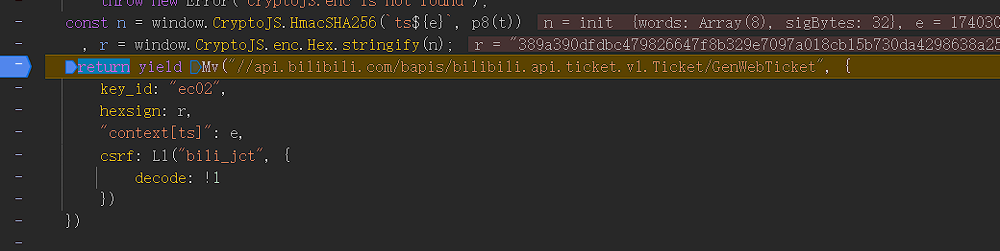
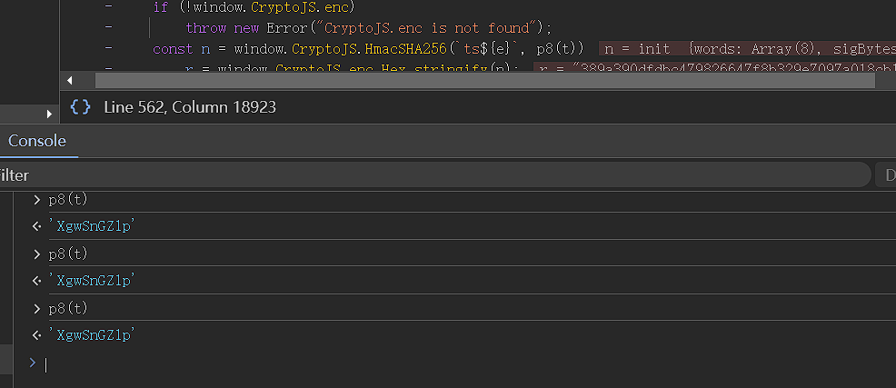
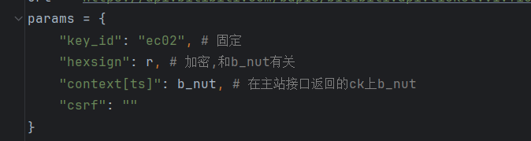
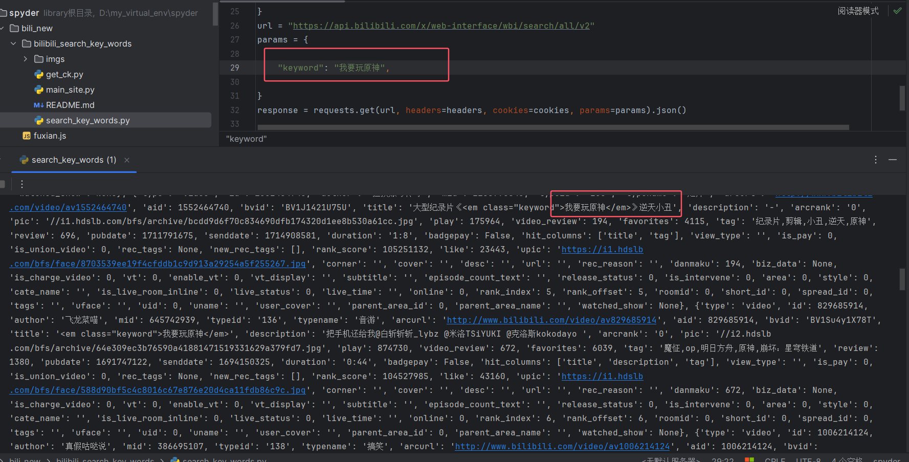

# b站视频关键词搜索接口bili_ticket逆向

主要是逆向这个r的生成

p8(t), t都是定值写死,r是一个SHA256

参数封装:

流程: 从https://www.bilibili.com/获得b_nut, 然后用b_nut获取bili_ticket, 最后将bili_ticket用于搜索关键词的接口(这是唯一必须的参数)

## 使用方式

直接运行search_key_words.py

示例, 搜索我要玩原神

